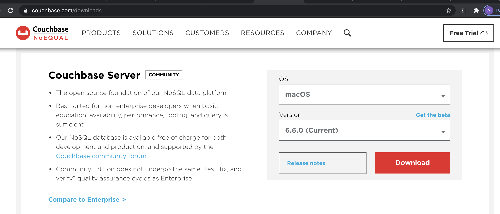
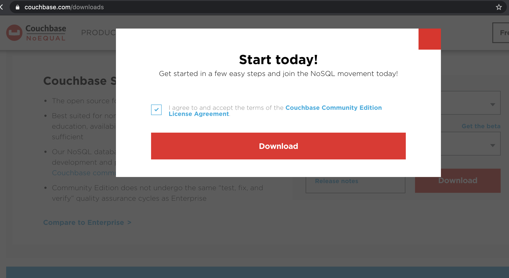
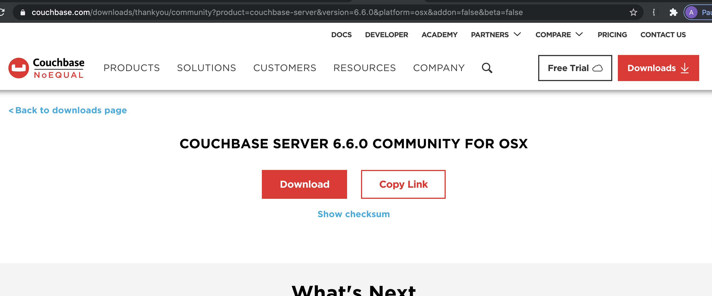

# CouchBase Installation in MacOS

### 1. Go to CouchBase Site and choose community version @ 6.6.0
https://www.couchbase.com/downloads



### 2. Check "I agree" and click "Download"
Check the `I agree` Checkbox after reading agreement if neccessary.



### 3. This will redirected to Download Page? Click download for dmg file.



### 4. Mount the the downloaded .dmg file.
hdiutil attach couchbase-server-community_6.6.0-macos_x86_64.dmg

```
➜  Downloads hdiutil attach couchbase-server-community_6.6.0-macos_x86_64.dmg
/dev/disk6          	GUID_partition_scheme
/dev/disk6s1        	Apple_HFS                      	/Volumes/Couchbase Installer
```

### 5. Copy the Couchbase Server.app file into the system /Applications folder.
```
cp -R /Volumes/Couchbase\ Installer\ /Couchbase\ Server.app/ /Applications/
```

### 6. Remove the Gatekeeper quarantine flag from Couchbase Server.app.
```
sudo xattr -d -r com.apple.quarantine /Applications/Couchbase\ Server.app
```

### 7. Start CouchBase Server
```
open -a Couchbase\ Server.app
```

# Boom !! You are done with Installation 

